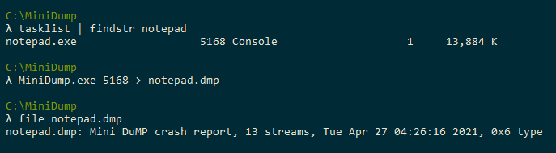

# Transacted MiniDump - A fileless MiniDump utility

[](LICENSE.txt)

MiniDump will create a mini dump of a running process and write it to stdout.
MiniDump works by creating a transaction to open an existing file, calling `MiniDumpWriteDump` using that file, writing the contents of the file to stdout, then rolling back the transaction.
All versions of Windows from NT 6.0 (Vista) to NT 10.0 are supported.



## Background

The COM+ Services DLL (e.g. `comsvcs.dll`) has an exported function named `MiniDump`.
The `MiniDump` function can be ran via `rundll32.exe` to create a mini dump crash report for a running process.
The pentesting community has used this feature since 2019 to assist in recovering passwords from `lsass.exe`.

The downside to using this feature is that it will create a new file on the host's file system.
This is not ideal.
The `MiniDump` function will essentially create a new file for a path that you specify and use that file in the following function call.
```cpp
MiniDumpWriteDump(processHandle, processId, fileHandle, MiniDumpWithFullMemory | MiniDumpWithHandleData, nullptr, nullptr, nullptr);
```

The `MiniDumpWriteDump` function can be called directly and can take a file handle that is open in transaction that has not yet been commited to disk.
If you open a file in a file transaction and write a mini dump to it, you can read the contents mini dump then rollback the transaction causing no changes to the file system.

## Links

* [MiniDumpWriteDump via COM+ Services DLL](https://modexp.wordpress.com/2019/08/30/minidumpwritedump-via-com-services-dll/)
* [Lost in Transaction: Process Doppelgänging](https://www.blackhat.com/docs/eu-17/materials/eu-17-Liberman-Lost-In-Transaction-Process-Doppelganging.pdf)
